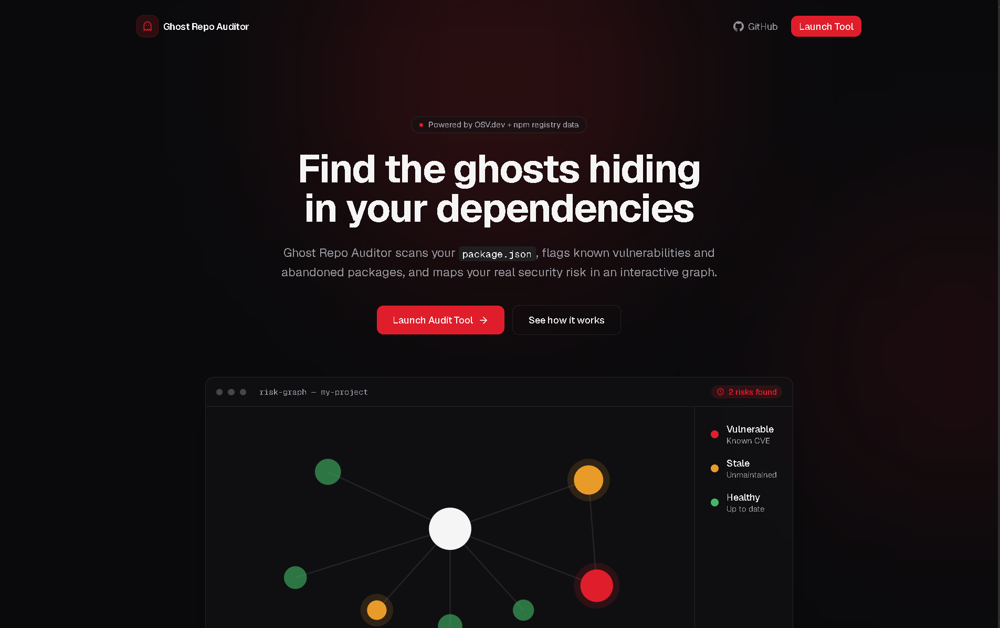
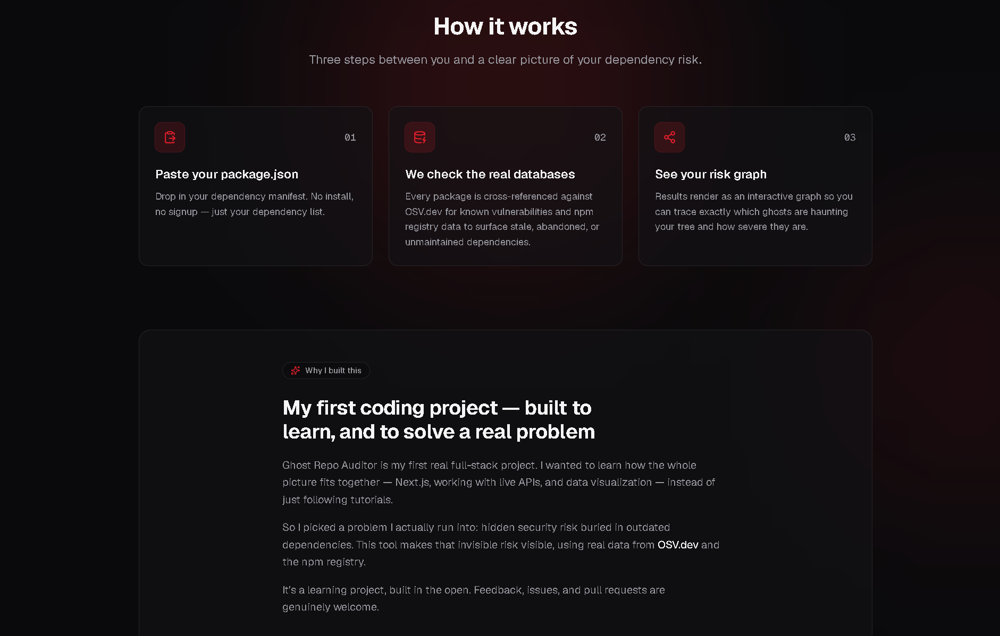
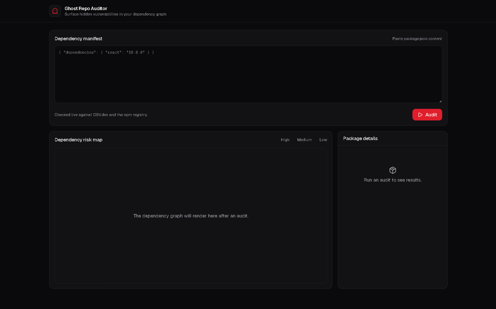

# Ghost Repo Auditor

Find the ghosts hiding in your dependencies. A full-stack tool that scans a project's `package.json`, checks every dependency against real vulnerability data (OSV.dev) and npm staleness data, and visualizes risk in an interactive graph.

🔗 **Live demo:** [your-vercel-url-here]

## Why I built this
[Your honest 2-3 sentences — same story as your landing page]

## Features
- Real vulnerability scanning via the OSV.dev API (not AI guesses — actual CVE/GHSA data)
- Dependency staleness detection via the npm registry
- Interactive risk-graph visualization
- Dark mode, responsive dashboard UI

## Tech stack
Next.js · React · Tailwind CSS · OSV.dev API · npm Registry API

## Running locally
\`\`\`bash
git clone https://github.com/GhostKernel19/ghost-repo-auditor
cd ghost-repo-auditor
npm install
npm run dev
\`\`\`

## Screenshots
[,,]